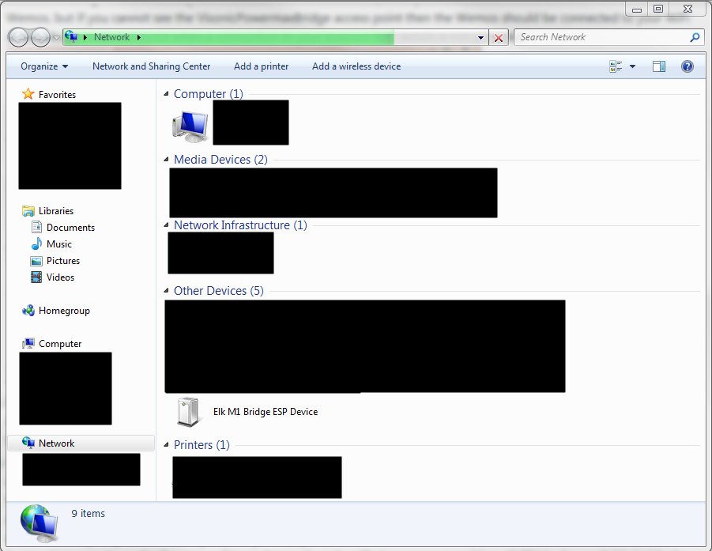

# Instructions for setting up the Elk M1 integration for SmartThings

This code has been written to interface an ESP8266 into SmartThings (I recommend a Wemos D1 R2 if integrating with a Serial connection to the alarm, but if you have an Ethernet connection to an XEP module then you can use a NodeMCU). I have created all code myself, based on an integration for another alarm so for those wanting to donate then my beer fund would gladly appreciate it :) - https://paypal.me/cjcharles.

Some important points to note:
1) The website created by the ESP8266 is currently not password protected (on my to do list eventually) but realistically your WiFi security is probably just as good as your alarm security so unlikely to be a problem. I take no responsibility for your security!
2) I strongly recommend giving your ESP8266 a fixed IP address in your router config since otherwise you will need to update your settings whenever the IP changes. The same applies to SmartThings and the Elk M1 XEP module (if you have the Ethernet setup).
3) If you are triggering an alarm from ST, then it will effectively press F1 on Keypad 1. If you have re-programmed this to do something other than trigger an alarm then it will do this action instead!
4) The tile about Off/Strobe/Siren/Both is a way of linking the alarm with other actions since using Disarm/ArmHome/Alarm... only works in some situations. You can link them in CoRE with the following lookup - Off=Disarm, Siren=ArmAway, Strobe=ArmHome, Both=Alarm - hence if the status changes to 'siren' then it has been armed in away mode, but you can also set it to 'strobe' and it will arm itself in home mode.
5) Sometimes the Alarm Panel device gets stuck when creating child devices (gives an error about null device), in this situation I suggest using the test function and testtile (add or remove the // at the start of line 152). After pressing save+publish SmartThings will show/hide the tile allowing you to create temporary child device. Now you can remove all child devices using the 'Remove' button, now press the test function button and you should see a temp device in your device list. Now you can remove all child devices again to remove the temp device, and finally press "Create Child Devices" again, this time it should be successful.

The key steps to follow when setting up the integrations are as follows (if you have bought your own Wemos then you will need to start with the steps at the bottom of this):

1) Turn on the ESP by plugging into Micro USB and you will see a WiFi Access Point created, called "AlarmBridge" (it might take a minute to appear). Connect to this access point (no password needed) and navigate to 192.168.4.1 (should be automatic on most phones if you try and use the access point for browsing). On the page that appears, you should select your own WiFi network (2.4GHz only) by choosing from the menus and adding your password.
2) After this is complete you should see the ESP connect to your router (and should even be visible from within Windows as a Network device under the 'Network' view. Update the router so that this device is always given the same IP address, this is called a DHCP reservation and without it you may find things stop working after IP addresses change (ST is getting better at dealing with this, but if you can do it then it will be better). It may take some time for the router to detect the Wemos, but if you cannot see the AlarmBridge access point then the Wemos should be connected to your WiFi (it broadcasts its access point when a connection to your entered WiFi details is not possible).

3) Navigate to the IP address that the Wemos has been given (take note of it) and you should see a VERY simple dashboard. Also take note of the MAC address listed on this page (it is a string of 12 letters and numbers). You can now disconnect the power and move to final location if moving it.
4) If you are connecting the ESP to the Elk M1 via Serial then now is a good time to connect it to the panel. You will need to provide power, ground, RX and TX (Note that Wemos RX should connect to TX on the alarm, and vice versa). I suggest providing power via the barrel connection on the Wemos since that will accept 12V from the alarm, and has a over-voltage protection circuitry.
5) If you are connecting the ESP to the XEP / Elk via Ethernet then you will need to go to the following web address IP_OF_ESP/config?ip_for_alarm=192.168.1.200&port_for_alarm=2101&alarm_password=003456. Though you will need to change the ip_for_alarm to be the actual IP address of the XEP module, and you will need to change the alarm_password to be your alarm pin (add two zeroes at the start if you have a 4 digit PIN code)
5) Check the Wemos is talking to the Powermax alarm by visiting the IP address of the Wemos again and clicking on 'Alarm status' under the JSON endpoint section. You should see the status at the top of the Status page saying Disarmed. You can then go to the /getzonenames page and after a short period of time refresh the page - it should now show all of your alarms zones.
6) You should now be able to press Disarm/ArmHome/ArmAway on the Wemos webpage and you should hear your alarm respond! Anything not working at this stage will not improve with the following SmartThings steps. If you cannot do any of these steps then please discuss on the ST forums before proceeding - https://community.smartthings.com/t/release-visonic-powermax-alarm/84119 .
7) [Install this device handler into SmartThings (you only need one device handler now, called "Alarm Panel Bridge").](https://github.com/cjcharles0/SmartThings/blob/master/VisonicAlarm/Device-AlarmPanelBridge) Copy and paste as code, nothing else should need to be changed at this stage.
8) Create a device in SmartThings and give it a name of "Elk Alarm" (or whatever you wish), plus a DNI (Device Network ID) of the MAC address from above (this should be entered in capital letters and without colons i.e. AABBCCDDEEFF). Ensure it uses the Device Handler called 'Alarm Panel Bridge' and other settings as required (i.e. choose your hub and set it as published).
9) Modify the 'Alarm Panel Bridge' device handler to add extra tiles for each zone (I have added support for up to 40 zones, above that you will need to get in touch with me). Add the tiles to the details section (lines 168-169) by adding a 'zoneX' and one 'zonenameX' for each zone. Do not modify the zonename here (except the numbers), it will automatically populate from the ESP, just change the X numbers to match the increase from 1 to 8. Ensure you press Save and Publish.
10) Open the new Alarm device (e.g. if you called it 'Elk Alarm' in the above step) on SmartThings on your phone and go into settings. Here you should add the IP address for your Wemos, and I also suggest adding a Pre and/or Post name in the settings (e.g. putting 'Alarm' in PreName means that all created zones will have 'Alarm' added at the front of them - this will make them easier to identify in your device list.).
11) Now after saving the settings, stay on the 'Elk Alarm' page and press 'Refresh' and after 10s press 'Configure'. You should see the device populate information about alarm status and zone names, plus it will also send the SmartThings IP address to Wemos so Wemos can automatically send SmartThings status updates.
12) If you press create devices it should now create individual devices for each of your Alarm zones, these will stay in sync with the tiles on your Elk Alarm Panel device! If this does not work, and you see an error about null devices in the Live Log, you need to read step 7 of the questions at the top of this Readme.

You should finally have a fully linked Elk M1 Alarm inside SmartThings and have each of the zones separately broken out!! Woop woop!!
