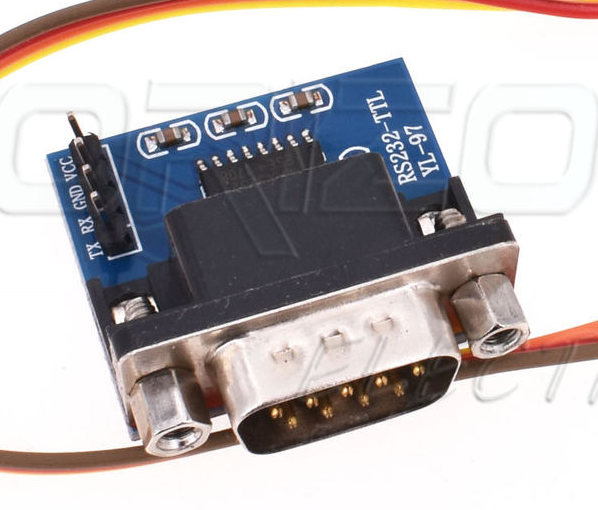

# Instructions for setting up the Elk M1 integration for SmartThings

This code has been written to interface an ESP8266 into SmartThings (I recommend a Wemos D1 R2 if integrating with a Serial connection to the alarm, but if you have an Ethernet connection to an XEP module then you can use a NodeMCU). I have created all code myself, based on an integration for another alarm so for those wanting to donate then my beer fund would gladly appreciate it :) - https://paypal.me/cjcharles.

Some important points to note:
1) The website created by the ESP8266 is currently not password protected (on my to do list eventually) but realistically your WiFi security is probably just as good as your alarm security so unlikely to be a problem. I take no responsibility for your security!
2) I strongly recommend giving your ESP8266 a fixed IP address in your router config since otherwise you will need to update your settings whenever the IP changes. The same applies to SmartThings and the Elk M1 XEP module (if you have the Ethernet setup).
3) If you are triggering an alarm from ST, then it will effectively press F1 on Keypad 1. If you have re-programmed this to do something other than trigger an alarm then it will do this action instead!
4) The tile (on SmartThings new app) about Off/Strobe/Siren/Both is a way of linking the alarm with other actions through CoRE/WebCore, since using Disarm/ArmAway/ArmHome/Alarm... is only accessible in some situations. You can link them in CoRE with the following lookup - Off=Disarm, Siren=ArmAway, Strobe=ArmHome, Both=Alarm - hence if the status changes to 'siren' then the alarm has been armed in away mode, but you can also set it to 'strobe' and it will arm itself in home mode.
5) The ESP can now detect if you have a door/window sensor rather than a motion sensor, it does this based on the name of your zone. Please ensure in the Elk config that you name the zone to include one of the following if you want it to show as an open/closed contact: 'Door', 'door', 'Dr', 'dr', 'Window', 'window', 'Wind', 'wind', 'Win', 'win', 'Wdw', 'wdw'
6) Make sure you are not in Remote Programming mode of Elk Computer software as this has an exclusive lock when programming and won’t allow other communicaiton through the ESP. Make sure “Access Mode” is unchecked for the user code you are saving into the ESP or it wont allow remote access.
7) I suggest leaving the MQTT settings, unless you definitely want it, as it is unnecessary complexity! The ST IP/Port should be used as your MQTT server if you do want to setup MQTT mode.

The key steps to follow when setting up the integrations are as follows (if you have bought your own Wemos then you will need to start with the steps at the bottom of this):

1) Turn on the ESP by plugging into Micro USB and you will see a WiFi Access Point created, called "AlarmBridge" (it might take a minute to appear). Connect to this access point (no password needed) and navigate to 192.168.4.1 (should be automatic on most phones if you try and use the access point for browsing). On the page that appears, you should select your own WiFi network (2.4GHz only) by choosing from the menus and entering your WiFi password/PSK.
2) After this is complete you should see the ESP connect to your router (and should even be visible from within Windows as a Network device under the 'Network' screen in Windows Explorer. Update the router so that this device is always given the same IP address, this is called a DHCP reservation and without it you may find things stop working after IP addresses change (ST is getting better at dealing with this, but if you can do it then it will be better). It may take some time for the router to detect the Wemos, but if you cannot see the AlarmBridge access point then the Wemos should be connected to your WiFi (it broadcasts its access point when a connection to your entered WiFi details is not possible).

3) Navigate to the IP address that the Wemos has been given (take note of it) and you should see a VERY simple dashboard. Also take note of the MAC address listed on this page (it is a string of 12 letters and numbers). You can now disconnect the power and move to final location if moving it.
4) ONLY If you are connecting via Serial (Wemos) then now is the time to move the Wemos to the Alarm enclosure and connect it to the Elk. You need to get DC power from some point inside the panel (it can be up to 16V DC so long as you use the barrel connection - hence why I advise a Wemos as it has the voltage protection circuitry - you cannot use AC but there is normally several DC power connections inside the panel). You will need a RS232-TTL converter module and this can plug straight into the Elk serial port, the outputs of this are RX/TX/Ground. You also need to connect RX on the Wemos to TX on the converter, and TX on the Wemos to RX on the converter, plus ground on the Wemos to ground on the converter. After this you will need to add a PIN code to the Wemos in order to control the Elk, you can do this by visiting the following web address IP_OF_ESP/advanced and changing the alarm password halfway down the page. (note you will need to change the alarm password to be a valid PIN code for the alarm and you need to add 2 zeroes at the start if you have a 4 digit PIN code). (if you need to use RS485 because the RS232 connection is used for something else then you will need to convert with an RS485/RS232-TTL converter to change between A/B and RX/TX). If you have a female RS232 converter then you can use a simple male/male cable to connect the converter to the alarm panel (the image below shows a male version).

5) ONLY If you are connecting the ESP to the XEP / Elk via Ethernet (NodeMCU) then you will need to configure some different parameters. Go to the settings page at IP_OF_ESP/advanced and set the IP/Port for Alarm (Elk XEP) and Smartthings, plus enter your alarm password (6 digits, so if you have a 4 digit PIN then you will need two zeroes at the start, hence a PIN of 3456 would be entered as 003456).
6) You can now check the Wemos is talking to the alarm by visiting the IP address of the Wemos again and clicking on 'Alarm status' (IP_OF_ESP/status) under the JSON endpoint section. You should see the status at the top of the Status page saying Disarmed, if not try refreshing the page once. Once you have got the status then you can then go to the /getzonenames page (link next to the status page) and you should see a message that it is trying to read the zone names. After a short period of time (perhaps wait 30seconds) you can refresh the page and it should now show all of your alarms zones.
7) You should now be able to press Disarm/ArmHome/ArmAway on the Wemos webpage and you should hear your alarm respond! If this is not working at this stage, it will not improve with the following SmartThings steps. Hence, if you are struggling then please discuss on the [ST forums before proceeding](https://community.smartthings.com/t/release-elk-m1-alarm-interface/132579).
8) [Install this device handler](https://github.com/cjcharles0/SmartThings/blob/master/VisonicAlarm/AlarmPanelBridge-DeviceHandler) into [SmartThings IDE](https://account.smartthings.com/login). You only need the one device handler, called "Alarm Panel Bridge").] Copy and paste as code, nothing else should need to be changed at this stage.
9) Create a device in SmartThings and give it a name of "Elk Alarm" (or whatever you wish), plus a DNI (Device Network ID) of the MAC address from above (this should be entered in capital letters and without colons i.e. AABBCCDDEEFF). Ensure it uses the Device Handler called 'Alarm Panel Bridge' and other settings as required (i.e. choose your hub and set it as published).
10) Modify the 'Alarm Panel Bridge' device handler to add extra tiles for each zone (I have added support for up to 40 zones in the firmware, above that you may need to get in touch with me if you need further guidance). Add the tiles to the details section (around lines 184 but just search for zonename1 to find the section) by adding a 'zoneX' and one 'zonenameX' for each zone. Do not modify the zonename here (except the numbers), it will automatically populate names from the Elk, just change the X numbers to match the existing numbers (e.g. you could add <b>, "zonename9", "zone9"</b> to add zone 9). You should also add the outputs that you have in the same way. If you have an output above 8 then you will need to scroll to the bottom of the device handler to add the on / off functions, just follow the same formatting for the existing 8. Ensure you press Save and Publish.
11) Open the new Alarm device in the Smartthings new app on your phone and go into settings - here you should add the IP address for your Wemos, and I also suggest adding a Pre and/or Post name in the settings (e.g. putting 'Alarm' in PreName means that all created zones will have 'Alarm' added at the front of them - this will make them easier to identify in your device list.). Now press Save to store these settings.
12) For outputs which you want to show in ST, they must either have a name, or you need to trigger them now. To do this just turn them on and off using your existing control methods, when doing this the Elk will tell the ESP that they exist, and hence the ESP can tell SmartThings.
13) Now connect back to the ESP IP address and navigate to the 'Configure Child Devices' page, from here you can create the child devices ('Create Child Zones' link) and they should automatically appear in SmartThings. If you are struggling to get the child devices to appear then I suggest having the 'Live Logging' page open while you press 'Create Child Zones', the messages which appear can then be sent to me, or pasted in the SmartThings forum to help debug what might be wrong.

You should finally have a fully linked Elk M1 Alarm inside SmartThings and have each of the zones separately broken out!! Woop woop!!
