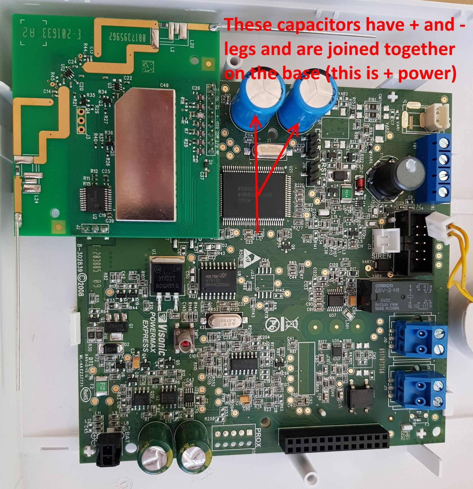

For *most* Powermax Express devices you will need to take power from the Powermax via a soldered connection, since most boards use an AC power supply and have no onboard DC connection.

If you have a DC power supply (it will be labelled as DC output), then the easiest option is to join an extra wire to the positive/red wire from the power supply to the Powermax - this can now connect to the Wemos.

If you have an AC power supply, the easiest place to do this is on the two big capacitors (near where you plug in the AC power supply). Each capcitor has two pins (positive and negative) and as in the image, the Positive connections are joined together - we need to solder to either end of this PCB trace between the positive pins.

