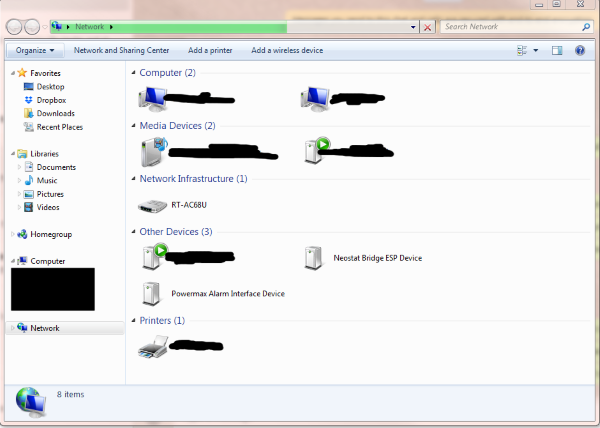
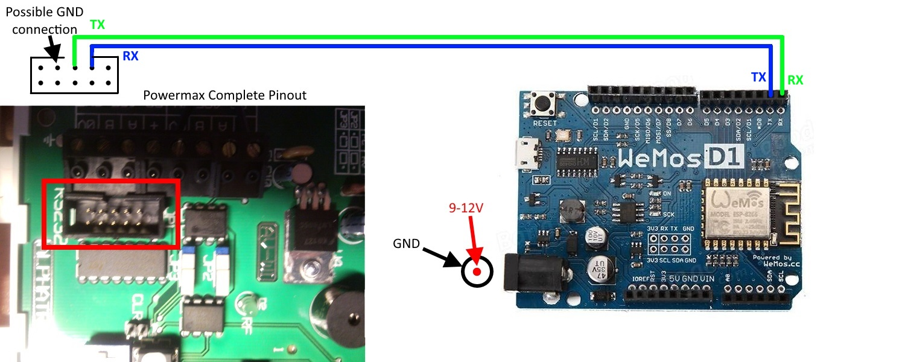

# Instructions for setting up Powermax into SmartThings

This code has been written to interface an ESP8266 Wemos D1 R2 into SmartThings. The Arduino code is highly based on the PMax C++ library created by unknown people on https://www.domoticaforum.eu and then integrated onto a Wemos D1 R2 by irekz (https://github.com/irekzielinski/PowerMaxAlarm). I have then modified it and created some extra functions in order to interface with SmartThings.

Some important points to note:
1) The website created by the ESP8266 is currently not password protected (on my to do list eventually). I take no responsibility for your Powermax security! Though TBH if you are worried about your WiFi being hacked and then burgled then you should be using a more secure alarm system!
2) I strongly recommend giving your Wemos a fixed IP address in your router config since otherwise you will need to update your settings whenever the IP changes
3) I have created a custom inactvity motion timeout as Visonic gives no notification that motion has stopped, this will default to 10s after every reboot, but you can configure it through SmartThings.
4) If your Visonic Powermax is complaining about 'comms fail' and 'system trouble' after replacing the Powerlink module then go into installer settings, remove the ip address to send information to (make it 0.0.0.0). Then you need to disconnect the alarm power and its battery. After waiting for 30 seconds you can connect it back up and your alarm will no longer show an error message.
5) The tile about Off/Strobe/Siren/Both is a way of linking the alarm with other actions since using Disarm/ArmHome/Alarm... sometimes does not work. You can link them in CoRE with the following lookup - Off=Disarm, Siren=ArmAway, Strobe=ArmHome, Both=Alarm - hence if the status changes to 'siren' then it has been armed in away mode, but you can also set it to 'strobe' and it will arm itself in home mode. To trigger an alarm on the Powermax you will need some extra circuitry - described here https://github.com/cjcharles0/SmartThings/tree/master/VisonicAlarm/AlarmCircuitry
6) Sometimes the Alarm Panel device gets stuck when creating child devices (gives an error about null device), in this situation I suggest using the test function and testtile (add or remove the // at the start of line 147). After pressing save+publish SmartThings will show/hide the tile allowing you to create temporary child device. Now you can remove all child devices using the button, now press the test function button, now you should see a temp device in your device list. Now you can remove all child devices again to remove the temp device, and finally press "Create Child Devices" again, this time it should be successful.
7) If you have a very old Powermax+ or American style Powermax Pro, you might need to use an Arduino Nano in between the Powermax TX and the Wemos RX - this is because old Powermax devices seem to have very poor UART pins. You can find the full instructions for this step inside the ArduinoFiles folder.
8) I strongly recommend using the Wemos since it has the circuitry to step the voltage down to 3V3 and 5V onboard. If you use another power supply (e.g. USB), then the communication with the alarm is much less reliable.
9) For those wanting to donate then my beer fund would gladly appreciate it :) - https://paypal.me/cjcharles

The key steps to follow when setting up the integrations are as follows (if you have bought your own Wemos then you will need to start with the steps at the bottom of this):

1) Turn on the Wemos by plugging into Micro USB and you will see a WiFi Access Point created, called "VisonicPowermaxBridge" (it might take a minute to appear). Connect to this access point (no password needed) and navigate to 192.168.4.1 (should be automatic on most phones if you try and use the access point for browsing). On the page that appears, you should select your own WiFi network (2.4GHz only) by choosing from the menus and adding your password.
2) After this is complete you should see the Wemos connect to your router (and should even be visible from within Windows as a Network device under the 'Network' view. Update the router so that this device is always given the same IP address, this is called a DHCP reservation and without it you may find things stop working after IP addresses change (ST is getting better at dealing with this, but if you can do it then it will be better). It may take some time for the router to detect the Wemos, but if you cannot see the VisonicPowermaxBridge access point then the Wemos should be connected to your WiFi (it broadcasts its access point when a connection to your entered WiFi details is not possible).

3) Navigate to the IP address that the Wemos has been given (take note of it) and you should see a VERY simple dashboard. Also take note of the MAC address listed on this page (it is a string of 12 letters and numbers). You can now disconnect the power and connect to the Powermax alarm.
4) Connect the Wemos to the Powermax alarm. You need four connections: Power, Ground, RX and TX (RX on the Visonic Alarm Panel goes to TX on the Wemos and vice versa). The image below shows the connections between Wemos and Powermax, this pin header should be identical on all Powermax panels. I use 12V since it is easy to get from inside the alarm, plugs into the barrel connector of the Wemos quickly and easily, plus there is lots of spare 12V capacity from the onboard voltage regulators. If using anything else (e.g. 5V) then ensure it is within spec of the Wemos Vin and beware that it may place a strain on the Powermax 5V regulators, though unlikely to cause a problem. (3.75V is also available inside the alarm but I strongly recommend against using it, since it is outside of Wemos specification and the voltage regulator is unlikely to be strong enough). If you have a USA version Powermax Pro, or UK version Powermax+ then you will need to install an Arduino between the Wemos and Powermax (see https://github.com/cjcharles0/SmartThings/tree/master/VisonicAlarm/ArduinoFiles for more details). If you have a Powermax Express with an AC power supply then you will need to see here for finding the easiest place to get a DC power supply https://github.com/cjcharles0/SmartThings/tree/master/VisonicAlarm/PowermaxExpress

5) Check the Wemos is talking to the Powermax alarm by visiting the IP address of the Wemos again and clicking on 'Alarm status' under the JSON endpoint section. You should see the status at the top of the Status page saying disconnected, eventually it should say disarmed and then finally it will show the zones at the bottom of the JSON. If you do not see your zone names in the JSON (as defined in Powermax) then the Wemos has not paired with your Powermax board. The Wemos will auto enroll on Powermax Complete (can take 5 minutes), but on other alarms you will need to force the enroll by going into the Powermax Installer Mode and choosing 'Enroll Powerlink' (again please allow 5 minutes). If you are struggling to get this to work, then try resetting the Wemos by pressing the small button (or disconnecting power) and then waiting again. It can sometimes take a few repeats of this for it to enrol.
6) You should now be able to press Disarm/ArmHome/ArmAway on the Wemos webpage and you should hear your alarm respond! You should also see the full status page with alarm status, pin codes and zone names. Anything not working at this stage will not improve with the following SmartThings steps. If you can arm but not disarm, then the Wemos is able to talk to the Powrmax but it cannot enrol successfully, hence you will need to keep trying on step 8, or discuss on https://community.smartthings.com/t/release-visonic-powermax-alarm/84119
7) Install the device handler into SmartThings (you only need one device handler now, called "Alarm Panel"). Copy and paste as code, nothing else should need to be changed at this stage.
8) Create a device in SmartThings and give it a name of "Visonic Alarm" (or whatever you wish), plus a DNI (Device Network ID) of the MAC address from above (this should be entered in capital letters and without colons i.e. AABBCCDDEEFF). Ensure it uses the Device Handler called 'Visonic Alarm Panel' and other settings as required (i.e. choose your hub and set it as published).
9) Modify the 'Visonic Alarm Panel' device handler to add extra tiles for each zone (line 93 currently shows 8, this should be changed to your number of zones). Add the newly created tiles to the details section (lines 148-149) by adding one 'zoneX' and one 'zonenameX' for each zone. Do not modify the text, it will automatically populate from Powermax, just change the X numbers to match the increase from 1 to 8. Ensure you press Save and Publish.
10) Open the new Alarm device ('Visonic Alarm') on SmartThings on your phone and go into settings. Here you should add the IP address for your Wemos, and I also suggest adding a Pre and/or Post name in the settings (e.g. putting Visonic in PreName means that all created zones will have Visonic added at the front of them - this will make them easier to identify in your device list.). I suggest not changing the inactivity timeout yet.
11) Now after saving the settings, stay on the 'Visonic Alarm' page and press 'Refresh' and after 10s press 'Configure'. You should see the device populate information about alarm status and zone names, plus it will also send the SmartThings IP address to Wemos so Wemos can automatically send SmartThings status updates.
12) If you press create devices it should now create individual devices for each of your Visonic Zones that will stay in sync with the tiles on your Visonic Alarm Panel device! If this does not work, and you see an error about null devices in the Live Log, you need to read step 7 of the questions at the top of this Readme.

You should finally have a fully linked Visonic Powermax Alarm inside SmartThings and have each of the zones separately broken out!! Woop!!

These are the instructions if you are flashing your own Wemos:
1) Connect the Wemos to your computer and ensure that it appears in Windows Device Manager as a COM port (serial/USB bridge) - you may need a driver though hopefully it will automatically find it. Take a note of this COM port number.
2) Download the bin file and ESPtool.exe into the same folder and open a command prompt to this folder. (once the folder is open in Windows Explorer then hold shift and right click the background - that will allow you to 'Open a command prompt here')
3) Run the following command to flash the Wemos chip (change COMXX to be COM3 if the COM port identified above is #3): "esptool.exe -vv -cd nodemcu -cb 115200 -cp COMXX -ca 0x00000 -cf PowerMaxEsp8266.ino.bin"
4) You should see a success message, in which case you can start the main instructions above.

These are the instructions if you want to compile the code yourself in Arduino Studio (using Arduino Studio 1.6.9 and version 2.3.0 of the ESP8266 board library), note I may not have uploaded the most recent changes in code since I do it manually, hence the final step will ensure you are using the latest bin file for the code:
1) First set up Arduino Studio and add the Wemos D1 R2 (go to Tools menu, then Boards, then board manager and search for ESP8266)
2) Confirm that you now have the required ESP8266 libraries installed (if not you will need to add them from Sketch/Include Libraries/Manage Libraries - you might need to add them through (File > Preferences > towards the bottom of the window, copy this URL into the “Additional Board Manager URLs” text box: http://arduino.esp8266.com/stable/package_esp8266com_index.json)
3) Connect the Wemos D1 R2 to your computer and ensure the drivers are correct in order for it to show up in Arduino Studio
4) Add the PMAX library folder (5 files) to Arduino studio (the Libraries folder is normally in MyDocuments/Arduino/libraries) - hence it should be libraries/PMax/files-go-here. Alternatively download the 'PMax library folder.zip' file from this Github folder and point Arduino Studio towards this extra Library and it will automatically copy the five files to the right place.
5) Create a sketch and call is whatever you like (mine is called 'PowerMaxEsp8266'). Copy the Arduino code in this file. You can confirm if the PMax library was added successfully because the PMax bit at the top of the file will turn orange (though you might need to restart Arduino Studio first).
6) Ensure you select Wemos D1 R2 as the board, ensure the COM settings are correct. Then compile the code and upload to the Wemos
7) If you took this route it is probably worth going to IPADDRESSOFWEMOS/update and uploading the firmware (.bin) file located in this folder. I am less likely to keep the code up to date, but will ensure the firmware file is up to date.
